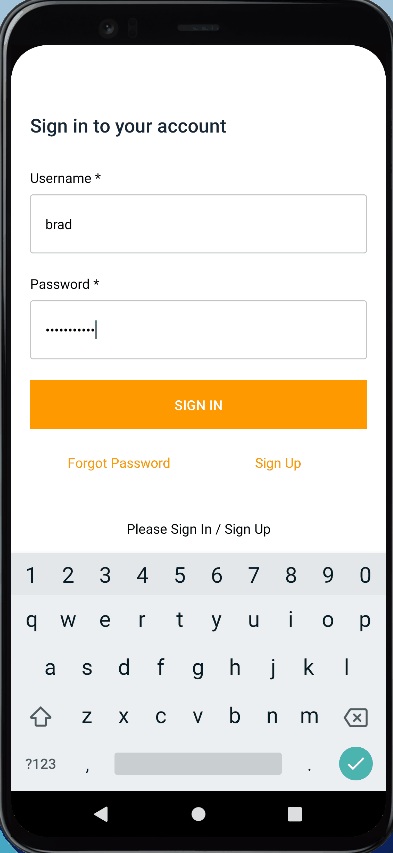
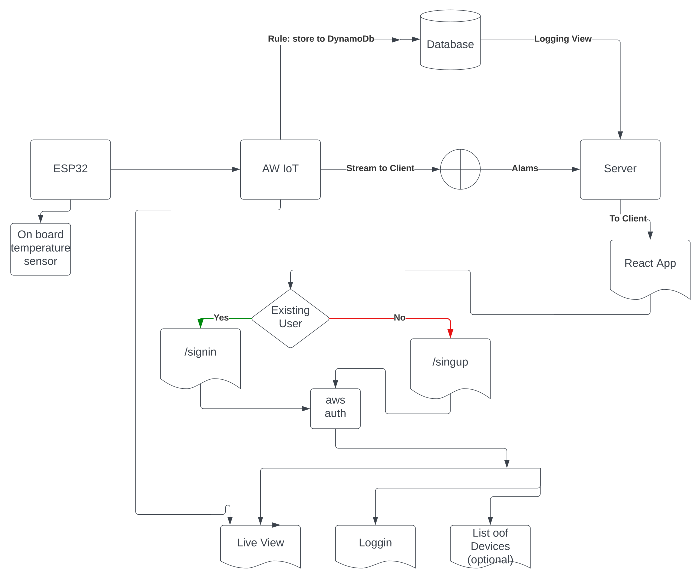

# Tempi
Tempi is a React-native app to display temperature data from an ESP32-WROOM developemnt board over to any device or over the web. <br/>
The temperature is dispalyed in <b>Live mode </b> with the plot updating in realtime and logging mod to view the historical data.

 &nbsp;  


----------------------------------------

## To run the app:
#### Make sure you have Expo installed 
[Expo](expo.dev)
```
- git clone git@github.com:bht822/iOT.git
- npm install
- expo install  #This ensure all node_modules are expo compatiable 
- expo run web
OR
- expo run android -d NameOfTheDevice
```

## System Flowchart


------------------------------------------------
## System Overview
#### ESP32 to AWS:
  - ###### The esp32 is connected to the AWS iOT which send the temp data over the MQTT protocol which is nothing more than machine 2 machine messaging service. <br/> You can configure the connection very easily [AWS blog](https://aws.amazon.com/blogs/compute/building-an-aws-iot-core-device-using-aws-serverless-and-an-esp32/) describes this process very well. 
    ###### Essentially follow these simple steps:
     - ##### Register for AWS account if you do not have one
     - ##### Search for AWS ioT core in the search panel or [AWS ioT Core](https://aws.amazon.com/iot-core/)
     - ##### Click on Manage > Things and follow the steps. I like how aws called their iot core things as it is independent of the firmware. If you are running freeRTOS or your own custom firmware, you can connect it all :smile:
     - ##### Obtain the device certificate and device CA key and take this info over to Arduino IDE and upload the code to your esp32
------------------------------
#### Storing Data to DynamoDB: <br />
   * ###### The data was stored in the DynamoDB by setting rules in the aws iOT core. Given there can be datapoint every second ( I choose 10000 ms for this project) the database can get complex and big very fast. Ideally a time stream database AWS timestream or indexDB is a better choice but I was more familiar with the dynamodb and express setup. 😇
-----------------------------
#### React-Native App for displaying the data. 
* ##### This is where things get interesting. I have done a similar project with Angular and I was certian of the steps but the react-native cross platform compatibility was a challenge but being careful of the libraries used I was able to acheive this task farily well. I used tailwind for some css as well which worked very well.
--------------------

### @TO DO:<br/>
#### 🔴 Increase UX change colors and fonts <br/>
#### 🔴 Move the configuration valirables to parameter store or something similar <br/>
#### 🔴 Setup CI/CD for the web project and deploy the tempiBackend to server so it can be assesed from the apps<br/>
#### 🔴 Try using AWS Timestream for storing data this can also be tied into the AWS insight<br/>
#### 🔴 Write Unit tests<br/>
